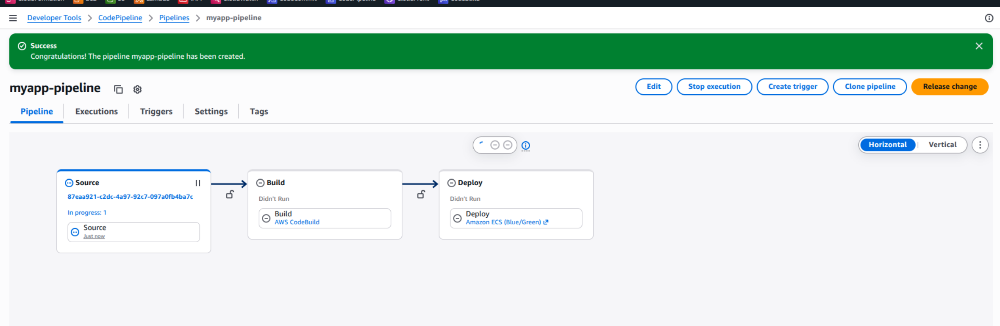
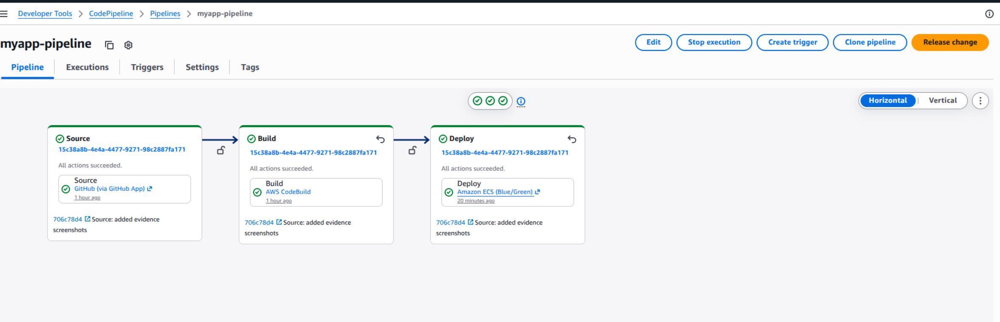
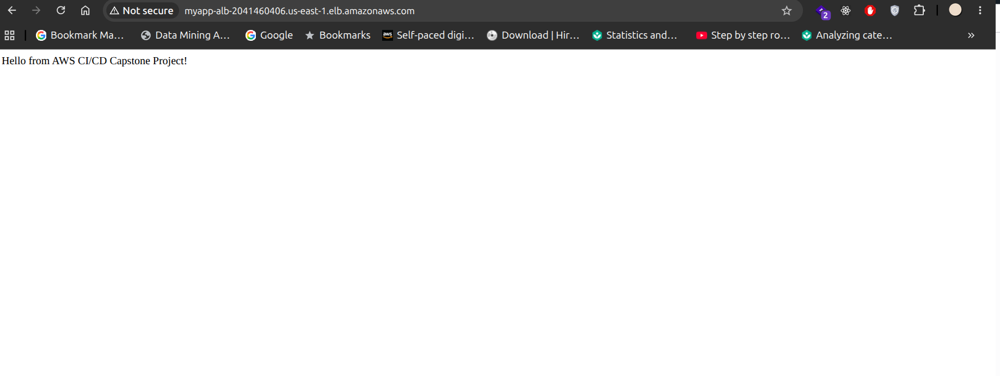
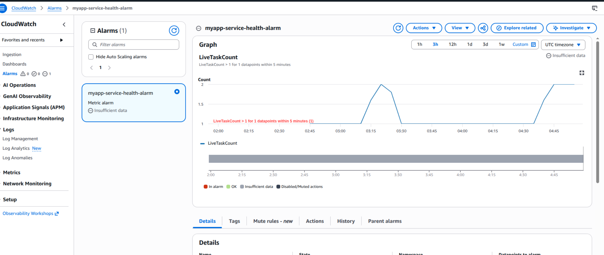

# Capstone Project 2: End-to-End CI/CD on AWS

This repository contains a sample Node.js app and AWS configuration files for a fully automated, production-grade CI/CD pipeline using AWS CodePipeline, CodeBuild, CodeDeploy, ECR, and ECS (Fargate).

## Architecture & Steps
1. **Source:** Push code to GitHub.
2. **Orchestration:** CodePipeline fetches the source and triggers CodeBuild.
3. **Build & Test:** CodeBuild installs dependencies, runs Jest unit tests, builds a Docker container, and pushes it to Amazon ECR.
4. **Deploy:** CodeDeploy updates the ECS Fargate service via a Blue/Green deployment strategy for zero downtime.
5. **Compute:** The ECS service serves the application behind an Application Load Balancer (ALB).

---

## Project Evidence & Screenshots

### 1. Pipeline Architecture Diagram
*(A visual representation of the final pipeline flow)*

### 2. Successful CodePipeline Execution
*(Shows all 4 stages succeeding: Source, Build, Deploy, and Manual Approval)*

### 3. Live Web Application
*(The browser view of the Node.js app accessed via the Application Load Balancer DNS)*

### 4. Observability & Monitoring
*(CloudWatch alarm configuration monitoring the ECS service health)*
